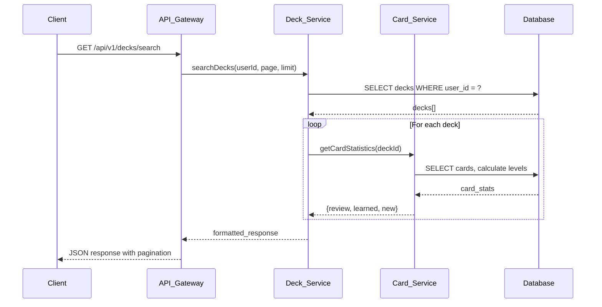
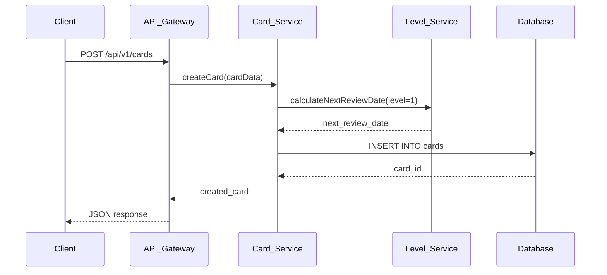
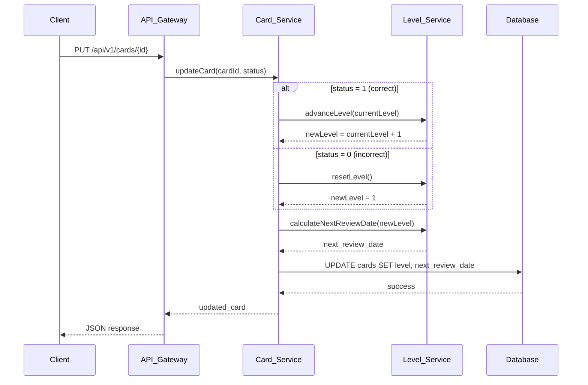

# User Requirements Document: Review Card MVP v1

## 1. Overview

### 1.1 Purpose
This document defines the User Requirements for the MVP features of Add and Review Card functionality in the Spaced Repetition Vocabulary Learning Software (SRVLS) v2.

### 1.2 Scope
This URD covers 6 core APIs and their corresponding UI screens for deck and card management with multiple choice review system.

### 1.3 Business Logic - Level System

#### Level Learning Table
| Level | Days to Review | Description |
|-------|---------------|-------------|
| 1     | 1 day         | New cards, review tomorrow |
| 2     | 3 days        | First successful review |
| 3     | 7 days        | Second successful review |
| 4     | 14 days       | Third successful review |
| 5     | 30 days       | Fourth successful review |
| 6     | 180 days      | Fifth successful review |
| 7     | 365 days      | Final level |

#### Card Classification Logic
- **Review Cards**: `level + last_time_learn = today` (cards due for review today)
- **New Cards**: `level + last_time_learn < today` (overdue cards that need immediate attention)
- **Learned Cards**: All other cards (future review dates or completed)

#### Level Update Logic
- **Correct Answer (status = 1)**: `current_level + 1` (maximum level 7)
- **Incorrect Answer (status = 0)**: `level = 1` (reset to beginning)

---

## 2. API Specifications

### 2.1 API 1: Search Decks with Pagination

#### Endpoint
```
GET /api/v1/decks/search
```

#### Description
Retrieve paginated list of user's decks with card statistics and classification.

#### Parameters
| Parameter | Type | Required | Description |
|-----------|------|----------|-------------|
| page | integer | No | Page number (default: 1) |
| limit | integer | No | Items per page (default: 10, max: 50) |
| search | string | No | Search term for deck name |
| user_id | string | Yes | User identifier |

#### Response Structure
```json
{
  "success": true,
  "data": {
    "decks": [
      {
        "deck_id": "deck_123",
        "deck_name": "Business English",
        "deck_icon": "🏢",
        "total_cards": 45,
        "review_cards": 8,
        "learned_cards": 34,
        "new_cards": 3,
        "progress_percentage": 75,
        "created_at": "2025-01-15T10:30:00Z",
        "updated_at": "2025-06-16T08:45:00Z"
      }
    ],
    "pagination": {
      "current_page": 1,
      "total_pages": 3,
      "total_items": 25,
      "items_per_page": 10,
      "has_next": true,
      "has_previous": false
    }
  },
  "message": "Decks retrieved successfully"
}
```

#### CURL Command
```bash
curl -X GET "https://api.vocabmaster.com/api/v1/decks/search?page=1&limit=10&user_id=user_456" \
  -H "Authorization: Bearer YOUR_JWT_TOKEN" \
  -H "Content-Type: application/json"
```

#### UI Screen Reference
**Screen: Dashboard - Pending Decks Section**
- Display deck cards in grid layout
- Show progress circles with percentage
- Display mini stats (learned, review, new)
- Include "Study Now" buttons for decks with review cards

---

### 2.2 API 2: Create Deck

#### Endpoint
```
POST /api/v1/decks
```

#### Description
Create a new flashcard deck for the user.

#### Request Body
```json
{
  "deck_name": "IELTS Vocabulary",
  "deck_icon": "🧪",
  "user_id": "user_456",
  "description": "Essential vocabulary for IELTS preparation"
}
```

#### Response Structure
```json
{
  "success": true,
  "data": {
    "deck_id": "deck_789",
    "deck_name": "IELTS Vocabulary",
    "deck_icon": "🧪",
    "user_id": "user_456",
    "description": "Essential vocabulary for IELTS preparation",
    "total_cards": 0,
    "created_at": "2025-06-16T14:20:00Z"
  },
  "message": "Deck created successfully"
}
```

#### CURL Command
```bash
curl -X POST "https://api.vocabmaster.com/api/v1/decks" \
  -H "Authorization: Bearer YOUR_JWT_TOKEN" \
  -H "Content-Type: application/json" \
  -d '{
    "deck_name": "IELTS Vocabulary",
    "deck_icon": "🧪",
    "user_id": "user_456",
    "description": "Essential vocabulary for IELTS preparation"
  }'
```

#### UI Screen Reference
**Screen: Library - Create New Deck Modal**
- Modal form with deck name input
- Icon selector dropdown
- Description textarea
- Create/Cancel buttons

---

### 2.3 API 3: Update Deck

#### Endpoint
```
PUT /api/v1/decks/{deck_id}
```

#### Description
Update deck name and basic information.

#### Request Body
```json
{
  "deck_name": "Advanced Business English",
  "deck_icon": "🏢",
  "description": "Updated description for advanced learners"
}
```

#### Response Structure
```json
{
  "success": true,
  "data": {
    "deck_id": "deck_123",
    "deck_name": "Advanced Business English",
    "deck_icon": "🏢",
    "description": "Updated description for advanced learners",
    "updated_at": "2025-06-16T15:30:00Z"
  },
  "message": "Deck updated successfully"
}
```

#### CURL Command
```bash
curl -X PUT "https://api.vocabmaster.com/api/v1/decks/deck_123" \
  -H "Authorization: Bearer YOUR_JWT_TOKEN" \
  -H "Content-Type: application/json" \
  -d '{
    "deck_name": "Advanced Business English",
    "deck_icon": "🏢",
    "description": "Updated description for advanced learners"
  }'
```

#### UI Screen Reference
**Screen: Library - Edit Deck Modal**
- Pre-populated form with current deck information
- Editable name field
- Icon selector
- Save/Cancel buttons

---

### 2.4 API 4: Delete Deck

#### Endpoint
```
DELETE /api/v1/decks/{deck_id}
```

#### Description
Delete deck and all associated cards permanently.

#### Response Structure
```json
{
  "success": true,
  "data": {
    "deck_id": "deck_123",
    "cards_deleted": 45,
    "deleted_at": "2025-06-16T16:45:00Z"
  },
  "message": "Deck and all associated cards deleted successfully"
}
```

#### CURL Command
```bash
curl -X DELETE "https://api.vocabmaster.com/api/v1/decks/deck_123" \
  -H "Authorization: Bearer YOUR_JWT_TOKEN" \
  -H "Content-Type: application/json"
```

#### UI Screen Reference
**Screen: Library - Delete Confirmation Modal**
- Warning message about permanent deletion
- Confirmation input (type "DELETE" to confirm)
- Delete/Cancel buttons with different styling

---

### 2.5 API 5: Create Manual Entry Card

#### Endpoint
```
POST /api/v1/cards
```

#### Description
Create a new flashcard with manual entry method.

#### Request Body
```json
{
  "deck_id": "deck_123",
  "user_id": "user_456",
  "front_text": "Serendipity",
  "back_text": "The occurrence and development of events by chance in a happy or beneficial way",
  "pronunciation": "/sɛrənˈdɪpɪti/",
  "example_sentence": "A fortunate stroke of serendipity led her to discover the hidden café",
  "description": "A pleasant surprise or unexpected discovery",
  "level": 1,
  "status": 0
}
```

#### Response Structure
```json
{
  "success": true,
  "data": {
    "card_id": "card_987",
    "deck_id": "deck_123",
    "user_id": "user_456",
    "front_text": "Serendipity",
    "back_text": "The occurrence and development of events by chance in a happy or beneficial way",
    "pronunciation": "/sɛrənˈdɪpɪti/",
    "example_sentence": "A fortunate stroke of serendipity led her to discover the hidden café",
    "description": "A pleasant surprise or unexpected discovery",
    "level": 1,
    "status": 0,
    "next_review_date": "2025-06-17T00:00:00Z",
    "created_at": "2025-06-16T17:20:00Z"
  },
  "message": "Card created successfully"
}
```

#### CURL Command
```bash
curl -X POST "https://api.vocabmaster.com/api/v1/cards" \
  -H "Authorization: Bearer YOUR_JWT_TOKEN" \
  -H "Content-Type: application/json" \
  -d '{
    "deck_id": "deck_123",
    "user_id": "user_456",
    "front_text": "Serendipity",
    "back_text": "The occurrence and development of events by chance in a happy or beneficial way",
    "pronunciation": "/sɛrənˈdɪpɪti/",
    "example_sentence": "A fortunate stroke of serendipity led her to discover the hidden café",
    "description": "A pleasant surprise or unexpected discovery",
    "level": 1,
    "status": 0
  }'
```

#### UI Screen Reference
**Screen: Add Words - Manual Entry Form**
- Deck selection radio buttons
- Word/phrase input field
- Pronunciation input field
- Definition textarea
- Example sentence textarea
- Submit button

---

### 2.6 API 6: Update Card

#### Endpoint
```
PUT /api/v1/cards/{card_id}
```

#### Description
Update card content and learning progress.

#### Request Body
```json
{
  "front_text": "Eloquent",
  "back_text": "Fluent and persuasive in speaking or writing",
  "pronunciation": "/ˈɛləkwənt/",
  "example_sentence": "She gave an eloquent speech that moved the entire audience",
  "description": "Having the ability to speak fluently and coherently",
  "level": 2,
  "status": 1,
  "last_reviewed_at": "2025-06-16T18:00:00Z"
}
```

#### Response Structure
```json
{
  "success": true,
  "data": {
    "card_id": "card_987",
    "front_text": "Eloquent",
    "back_text": "Fluent and persuasive in speaking or writing",
    "pronunciation": "/ˈɛləkwənt/",
    "example_sentence": "She gave an eloquent speech that moved the entire audience",
    "description": "Having the ability to speak fluently and coherently",
    "level": 2,
    "status": 1,
    "next_review_date": "2025-06-19T00:00:00Z",
    "last_reviewed_at": "2025-06-16T18:00:00Z",
    "updated_at": "2025-06-16T18:00:00Z"
  },
  "message": "Card updated successfully"
}
```

#### CURL Command
```bash
curl -X PUT "https://api.vocabmaster.com/api/v1/cards/card_987" \
  -H "Authorization: Bearer YOUR_JWT_TOKEN" \
  -H "Content-Type: application/json" \
  -d '{
    "front_text": "Eloquent",
    "back_text": "Fluent and persuasive in speaking or writing",
    "pronunciation": "/ˈɛləkwənt/",
    "example_sentence": "She gave an eloquent speech that moved the entire audience",
    "description": "Having the ability to speak fluently and coherently",
    "level": 2,
    "status": 1,
    "last_reviewed_at": "2025-06-16T18:00:00Z"
  }'
```

#### UI Screen Reference
**Screen: Review Session - Multiple Choice Interface**
- Question display with front_text
- Four multiple choice options (A, B, C, D)
- Color feedback system (green for correct, red for incorrect)
- Progress bar showing session completion

---

### 2.7 API 7: Delete Card

#### Endpoint
```
DELETE /api/v1/cards/{card_id}
```

#### Description
Delete a specific flashcard permanently.

#### Response Structure
```json
{
  "success": true,
  "data": {
    "card_id": "card_987",
    "deck_id": "deck_123",
    "deleted_at": "2025-06-16T19:30:00Z"
  },
  "message": "Card deleted successfully"
}
```

#### CURL Command
```bash
curl -X DELETE "https://api.vocabmaster.com/api/v1/cards/card_987" \
  -H "Authorization: Bearer YOUR_JWT_TOKEN" \
  -H "Content-Type: application/json"
```

#### UI Screen Reference
**Screen: Edit Card Modal - Delete Confirmation**
- Card preview showing front and back text
- Warning message about permanent deletion
- Confirm Delete/Cancel buttons

---

## 3. Backend Integration Sequences

### 3.1 Search Decks Sequence



### 3.2 Create Card Sequence



### 3.3 Update Card Review Sequence



---

## 4. UI Screen Specifications

### 4.1 Dashboard Screen

#### Components Required
- **Pending Decks Grid**: Display decks with review status
- **Progress Circles**: Visual representation of completion percentage
- **Mini Statistics**: Review, Learned, New card counts
- **Study Now Buttons**: Navigate to review session

#### Data Binding
- Use API 1 (Search Decks) for deck list
- Update counts based on card classification logic
- Refresh data on component mount and after review sessions

#### User Interactions
- Click deck card → Show deck actions modal
- Click "Study Now" → Navigate to review session
- Pull to refresh → Reload deck data

### 4.2 Add Words Screen

#### Components Required
- **Input Method Selection**: Manual Entry, Camera Scan, Import File
- **Deck Selection Grid**: Radio button selection with deck previews
- **Word Form**: Front text, back text, pronunciation, example
- **Create New Deck Option**: Inline deck creation

#### Data Binding
- Use API 1 (Search Decks) for deck selection options
- Use API 5 (Create Card) for form submission
- Use API 2 (Create Deck) for new deck creation

#### User Interactions
- Select input method → Show/hide relevant form sections
- Select deck → Update radio button state
- Submit form → Validate and create card
- Create new deck → Show inline creation form

### 4.3 Review Session Screen

#### Components Required
- **Progress Bar**: Show session completion
- **Question Display**: Front text with pronunciation
- **Multiple Choice Options**: Four buttons (A, B, C, D)
- **Color Feedback**: Green for correct, red for incorrect
- **Session Summary**: Final results and statistics

#### Data Binding
- Use API 1 (Search Decks) to get review cards
- Use API 6 (Update Card) for answer processing
- Generate distractors from system dictionary

#### User Interactions
- Select answer → Process immediately with color feedback
- Complete session → Show summary and return to dashboard
- Exit early → Save progress and return

### 4.4 Library Screen

#### Components Required
- **Deck Grid**: All user decks with progress indicators
- **Search/Filter Bar**: Search by deck name
- **Create Deck Button**: Primary action button
- **Deck Actions Modal**: Review, Edit, Delete options

#### Data Binding
- Use API 1 (Search Decks) with pagination
- Use API 3 (Update Deck) for editing
- Use API 4 (Delete Deck) for removal

#### User Interactions
- Search decks → Filter results in real-time
- Click deck → Show actions modal
- Edit deck → Show edit form modal
- Delete deck → Show confirmation dialog

---

## 5. Error Handling

### 5.1 Common Error Responses

#### 400 Bad Request
```json
{
  "success": false,
  "error": {
    "code": "VALIDATION_ERROR",
    "message": "Invalid request parameters",
    "details": [
      {
        "field": "deck_name",
        "message": "Deck name is required and must be between 1-100 characters"
      }
    ]
  }
}
```

#### 401 Unauthorized
```json
{
  "success": false,
  "error": {
    "code": "UNAUTHORIZED",
    "message": "Invalid or expired authentication token"
  }
}
```

#### 404 Not Found
```json
{
  "success": false,
  "error": {
    "code": "RESOURCE_NOT_FOUND",
    "message": "Deck not found or you don't have permission to access it"
  }
}
```

#### 500 Internal Server Error
```json
{
  "success": false,
  "error": {
    "code": "INTERNAL_SERVER_ERROR",
    "message": "An unexpected error occurred. Please try again later."
  }
}
```

### 5.2 Client-Side Error Handling

#### Network Errors
- Show retry button with exponential backoff
- Cache requests for offline functionality
- Display user-friendly error messages

#### Validation Errors
- Highlight invalid form fields
- Show inline validation messages
- Prevent form submission until errors are resolved

#### Loading States
- Show skeleton screens during API calls
- Disable buttons to prevent double submission
- Display progress indicators for long operations

---

## 6. Performance Requirements

### 6.1 API Response Times
- Search Decks: < 300ms for 50 decks
- Create/Update Operations: < 200ms
- Card Operations: < 150ms

### 6.2 Client-Side Performance
- Initial page load: < 2 seconds
- Navigation between screens: < 500ms
- Form submissions: < 1 second

### 6.3 Scalability Considerations
- Implement pagination for large deck collections
- Use lazy loading for card content
- Cache frequently accessed data
- Optimize database queries with proper indexing

---

## 7. Security Requirements

### 7.1 Authentication
- JWT tokens with 30-minute expiration
- Refresh token mechanism for seamless user experience
- Secure token storage in httpOnly cookies

### 7.2 Authorization
- User-based data isolation
- Deck and card ownership validation
- Rate limiting: 100 requests per minute per user

### 7.3 Data Validation
- Server-side validation for all inputs
- SQL injection prevention through parameterized queries
- XSS protection through input sanitization

---

## 8. Testing Requirements

### 8.1 API Testing
- Unit tests for all business logic
- Integration tests for API endpoints
- Load testing for concurrent users
- Security testing for common vulnerabilities

### 8.2 UI Testing
- Component unit tests
- End-to-end user flow testing
- Cross-browser compatibility testing
- Mobile responsiveness testing

### 8.3 Test Coverage
- Minimum 80% code coverage
- 100% coverage for critical business logic
- Automated testing in CI/CD pipeline

---

## Appendix A: Database Schema Updates

### Level Learning Table
```sql
CREATE TABLE level_learned (
  level INTEGER PRIMARY KEY,
  days_to_review INTEGER NOT NULL,
  description VARCHAR(255),
  created_at TIMESTAMP DEFAULT CURRENT_TIMESTAMP
);

INSERT INTO level_learned (level, days_to_review, description) VALUES
(1, 1, 'New cards, review tomorrow'),
(2, 3, 'First successful review'),
(3, 7, 'Second successful review'),
(4, 14, 'Third successful review'),
(5, 30, 'Fourth successful review'),
(6, 180, 'Fifth successful review'),
(7, 365, 'Final level');
```

### Updated Card Table
```sql
ALTER TABLE cards ADD COLUMN level INTEGER DEFAULT 1;
ALTER TABLE cards ADD COLUMN status INTEGER DEFAULT 0;
ALTER TABLE cards ADD COLUMN last_reviewed_at TIMESTAMP;
ALTER TABLE cards ADD COLUMN next_review_date TIMESTAMP;
```

## Appendix B: Sample Data

### Sample Deck Response
```json
{
  "deck_id": "deck_123",
  "deck_name": "Business English",
  "deck_icon": "🏢",
  "total_cards": 45,
  "review_cards": 8,
  "learned_cards": 34,
  "new_cards": 3,
  "progress_percentage": 75
}
```

### Sample Card Response
```json
{
  "card_id": "card_987",
  "deck_id": "deck_123",
  "front_text": "Serendipity",
  "back_text": "The occurrence and development of events by chance in a happy way",
  "pronunciation": "/sɛrənˈdɪpɪti/",
  "level": 2,
  "status": 1,
  "next_review_date": "2025-06-19T00:00:00Z"
}
```